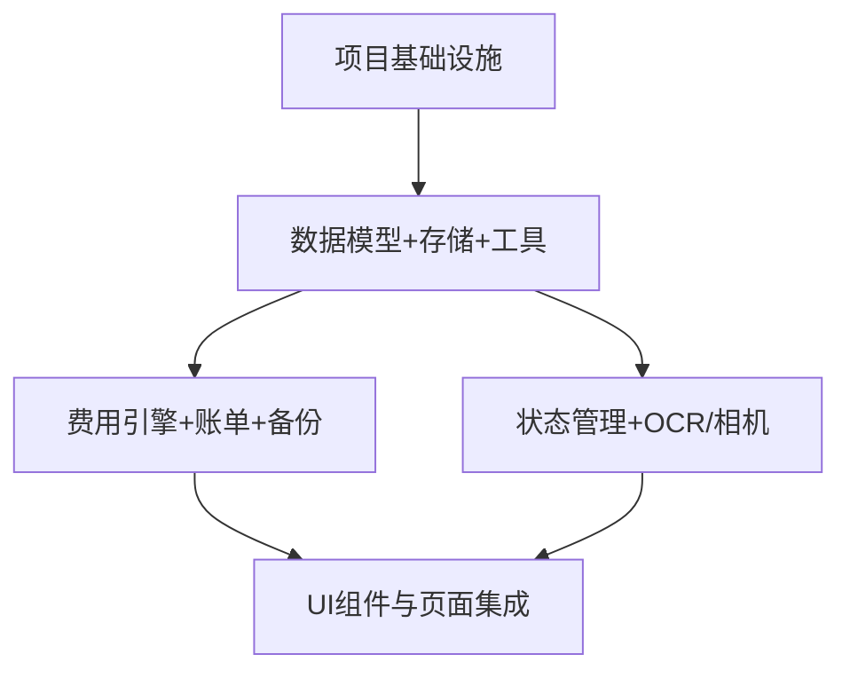

# 房东出租屋管理系统 — 系统设计 + 任务分解

> 阶段：架构设计（SOP 第二阶段产出）
> 角色：架构师 高见远（Bob）
> 项目根目录：`landlord-mgmt-system/`
> 形态：移动端优先 PWA（零安装，手机浏览器打开即像 App）
> 配套图：`docs/class-diagram.mermaid`（类图）、`docs/sequence-diagram.mermaid`（时序图）

---

## 1. 实现方案与框架选型

### 1.1 技术栈（主理人已定，遵循）

Vite + React 18 + MUI + Tailwind CSS；PWA；localStorage 存结构化数据，IndexedDB 存照片 Blob；Tesseract.js 端侧 OCR；无远端后端。

### 1.2 层选型与理由

| 关注点 | 选型 | 理由 |
|--------|------|------|
| 构建/开发 | **Vite** | 启动快、配置少、原生支持 PWA 插件与 TS |
| UI 框架 | **React 18** | 组件化、生态成熟、与 MUI 契合 |
| 组件库 | **MUI (@mui/material)** | 开箱即用移动端组件（TextField/Dialog/BottomNav）、响应式、中文友好 |
| 样式 | **Tailwind CSS** | 工具类快速做响应式布局，弥补 MUI 间距/布局细节 |
| PWA | **vite-plugin-pwa** | 自动生成 manifest + service worker，可"添加到主屏幕" |
| 状态管理 | **Zustand** | 比 Redux 轻，无 Provider 嵌套；每领域一个 store，store 只调 repository，不直接碰存储 |
| 结构化存储 | **localStorage**（经 `localStore.ts` 封装） | 5 名租户 + 少量房间，数据量极小；同步 API 简单；隐私上数据不出本机 |
| 照片存储 | **IndexedDB**（经 `idb` 封装 `photoDB.ts`，存 Blob） | Blob 不能进 localStorage（有 ~5MB 上限且需序列化）；IndexedDB 存二进制高效 |
| OCR | **Tesseract.js**（chi_sim） | 纯端侧、证件照不出本机；满足隐私红线 |
| 日期 | **date-fns** | 轻量、不可变、按"YYYY-MM"月度建模友好 |
| ID | `crypto.randomUUID()` | 浏览器原生，无需额外依赖 |

### 1.3 关键取舍与应对

- **PWA vs 原生 App**：选 PWA —— 零安装、零部署、隐私数据留本机。代价是 iOS Safari 对"添加到主屏幕"后部分能力受限（已可接受）。
- **localStorage vs IndexedDB（结构化数据）**：结构化数据走 localStorage 图简单；照片（唯一的大体积数据）必须走 IndexedDB 的 Blob，避免撑爆 localStorage 配额。
- **Tesseract.js 准确率**：中国身份证 OCR 对数字/姓名的识别不稳定（实测约 60–80%，受光线、角度影响大）。**设计原则：OCR 仅作"辅助录入"，结果回填表单供人工核对修正**，绝不作为权威值。提供"重拍/重识别"入口；身份证号最终以用户核对后的输入为准。

### 1.4 架构分层（依赖方向单向）

```
UI 层(pages/components)
   ↓ 读取/派发
Store 层(zustand, 按领域拆分)
   ↓ 调用
Service 层(费用引擎/账单/备份)
   ↓ 调用
Repository 层(repository.ts —— 统一数据访问抽象, 预留云端同步 seam)
   ↓
存储层(localStore=localStorage / photoDB=IndexedDB)
```

> **云端同步预留**：所有读写只经 `repository.ts`。未来若做可选云端同步，只替换/扩展该层实现，上层无感。MVP 不实现。

---

## 2. 文件列表及相对路径

```
landlord-mgmt-system/
├── package.json
├── vite.config.ts
├── tsconfig.json
├── tsconfig.node.json
├── tailwind.config.js
├── postcss.config.js
├── index.html
├── .gitignore
├── public/
│   ├── manifest.webmanifest
│   └── icons/icon-192.png
│   └── icons/icon-512.png
└── src/
    ├── main.tsx
    ├── App.tsx
    ├── vite-env.d.ts
    ├── router.tsx
    ├── types/
    │   └── index.ts                # 全部核心 TS 类型/枚举/接口
    ├── db/
    │   ├── localStore.ts           # localStorage 读写封装(结构化数据)
    │   ├── photoDB.ts              # IndexedDB(idb) 照片 Blob 存取
    │   └── repository.ts           # 数据访问抽象层(各实体 CRUD，云端同步 seam)
    ├── store/
    │   ├── tenantStore.ts          # 租户 store
    │   ├── roomStore.ts            # 房间 store
    │   ├── feeStore.ts             # 费用项 + 抄表/供暖记录 store
    │   └── billStore.ts            # 账单/缴费 store
    ├── services/
    │   ├── billingEngine.ts        # 费用引擎: 应收计算(月/季/年付 + 预存抵扣)
    │   ├── billGenerator.ts        # 账单生成: 聚合应收/已缴/欠费
    │   └── backup.ts               # 导出/导入 JSON 备份(含照片 base64)
    ├── ocr/
    │   └── idCardOCR.ts            # Tesseract.js 封装 + 姓名/身份证号解析
    ├── utils/
    │   ├── mask.ts                 # 脱敏(身份证号)
    │   ├── crypto.ts               # 敏感信息加密(Web Crypto API, AES-GCM)
    │   ├── date.ts                 # 月份/周期处理(date-fns 封装)
    │   ├── money.ts                # 金额(分存储/格式化)
    │   └── format.ts               # 通用格式化
    ├── hooks/
    │   ├── useCamera.ts            # 调摄像头拍照
    │   ├── useOCR.ts               # OCR 流程 hook
    │   └── usePhoto.ts             # 照片上传/画廊 hook
    ├── components/
    │   ├── layout/AppShell.tsx     # 整体布局(响应式 + 底部导航)
    │   ├── layout/NavBar.tsx
    │   ├── tenant/TenantForm.tsx
    │   ├── tenant/TenantList.tsx
    │   ├── tenant/TenantCard.tsx
    │   ├── room/RoomForm.tsx
    │   ├── room/RoomList.tsx
    │   ├── room/PhotoGallery.tsx
    │   ├── fee/FeeTypeManager.tsx
    │   ├── fee/MeterRecordForm.tsx
    │   ├── fee/HeatingFeeForm.tsx
    │   ├── bill/BillList.tsx
    │   ├── bill/BillDetail.tsx
    │   ├── bill/ReminderExport.tsx
    │   └── common/MaskedField.tsx
    │   └── common/PhotoUpload.tsx
    │   └── common/ConfirmDialog.tsx
    └── pages/
        ├── DashboardPage.tsx       # 首页: 欠费概览
        ├── TenantsPage.tsx
        ├── RoomsPage.tsx
        ├── FeesPage.tsx
        ├── BillsPage.tsx
        └── SettingsPage.tsx        # 备份/恢复/关于
```

---

## 3. 数据结构和接口（类图 + 关键类型）

> 完整类图见 `docs/class-diagram.mermaid`（Mermaid `classDiagram`）。以下为字段与关系说明 + 关键 TS 类型片段。

### 3.1 核心实体与关系

- **Tenant 1 — 0..1 Room**：MVP 一房一租户（1:1）；模型用 `Tenant.roomId` 与 `Room.tenantId` 双向引用，预留扩展为 1:N（未来 `Tenant.roomIds: string[]`）。
- **Room 1 — 0..\* Photo**：`Room.photoIds: string[]` 指向 `photoDB` 中的 Blob（照片不进 localStorage）。
- **Room 1 — 0..\* MeterRecord**：按月抄表读数。
- **Room/Tenant 1 — 0..\* HeatingFee**：供暖费按年/按状态。
- **Tenant 1 — 0..\* Payment**：缴费记录（含押金，用 `category` 区分）。
- **Tenant 1 — 0..\* Bill**：每月一份聚合账单；**Bill 由其他实体派生，非手工录入**。
- **Bill 1 — 1..\* BillItem**：账单明细，引用 `FeeType`。

### 3.2 枚举（types/index.ts）

```ts
type PaymentCycle = 'monthly' | 'quarterly' | 'yearly';   // 月付/季付/年付
type RoomStatus   = 'vacant' | 'rented';                  // 空置/出租
type FeeCategory  = 'rent' | 'electricity' | 'heating' | 'custom'; // 内置+自定义
type HeatingStatus= 'paid' | 'unpaid' | 'partial';        // 已缴/未缴/部分
type BillStatus   = 'settled' | 'owed' | 'partial';       // 已清/欠费/部分
type DepositType  = 'refundable' | 'offset';              // 可退/抵扣
```

### 3.3 关键接口（节选）

```ts
interface Tenant {
  id: string;
  name: string;
  idCardEnc: string;        // 加密存储(Web Crypto AES-GCM)
  idCardMasked: string;     // 脱敏展示, 如 110***********1234
  phone: string;
  paymentCycle: PaymentCycle;
  depositMonths: number;    // 收几个月押金
  depositType: DepositType; // 可退/抵扣
  depositDeductibleOnExit: boolean; // 退租是否可扣款
  idCardPhotoId?: string;   // 证件照(photoDB)
  roomId?: string;
  createdAt: string; updatedAt: string;
}
interface Room {
  id: string; name: string; monthlyRent: number; // 分
  status: RoomStatus; tenantId?: string; photoIds: string[];
  createdAt: string;
}
interface FeeType {
  id: string; name: string; category: FeeCategory;
  isBuiltin: boolean; unit?: string; unitPrice?: number; // 分
}
interface MeterRecord {
  id: string; roomId: string; month: string; // "YYYY-MM"
  prevReading?: number; currReading?: number; usage: number;
  recordedAt: string;
}
interface HeatingFee {
  id: string; roomId: string; tenantId: string; year: number;
  status: HeatingStatus; amount: number; paidAmount: number; paidDate?: string;
}
interface Payment {
  id: string; tenantId: string; roomId: string; billMonth: string;
  amount: number; category?: 'rent' | 'deposit' | 'other';
  paidAt: string; method?: string; note?: string;
}
interface BillItem {
  feeTypeId: string; feeName: string; amount: number; // 分
  periodCovered?: string; note?: string;
}
interface Bill {
  id: string; tenantId: string; roomId: string; month: string;
  items: BillItem[]; totalReceivable: number; totalPaid: number;
  outstanding: number; status: BillStatus; generatedAt: string;
}
```

---

## 4. 程序调用流程（时序图）

> 完整时序图见 `docs/sequence-diagram.mermaid`，覆盖三条主流程：① 新增租户(OCR 录入) ② 录用电量并生成当月账单 ③ 导出/导入备份。此处仅给要点。

### ① 新增租户（OCR 录入）
`useCamera` 拍照 → `photoDB.saveBlob` 得 `photoId` → `useOCR` 调 `tesseract.js`(chi_sim) → `idCardOCR` 解析姓名/身份证号回填表单 → **用户核对修正** → `crypto.encrypt(idCard)` 得 `idCardEnc`，`maskIdCard` 得 `idCardMasked` → `tenantStore.addTenant` → `repository.create('tenant')` → `localStore.setItem`。

### ② 录入用电量并生成当月账单
`MeterRecordForm` 录入上期/本期读数（或直填用量）→ `feeStore.saveMeterRecord` → `billStore` 拉取 tenant/room/feeTypes/meterRecords/heatingFees/payments → `billingEngine.computeMonthlyBill(ctx)` 产出 `BillItem[]` → `billGenerator` 聚合 `totalReceivable`，比对 `totalPaid` 得 `outstanding` → `repository.upsert('bill')`。

### ③ 导出/导入备份
导出：`backup.exportAll()` → `repository.getAllEntities()` + `photoDB.getAllBlobs()` → Blob 转 base64 → 组装 `{version,exportedAt,data,photos}` → 浏览器下载 JSON。
导入：`backup.importAll(file)` → 校验 schema → `localStore` 覆盖各实体 + `photoDB` base64→blob 批量写回 → 刷新。

---

## 5. 任务列表（有序、含依赖、按实现顺序）

> 规则：≤5 个任务、每任务 ≥3 文件、首任务为"项目基础设施"、任务间尽量浅依赖（仅 T03/T04 依赖 T02，T05 依赖 T02/T03/T04；T03 与 T04 互不依赖，可并行）。每条含负责模块/文件与验收点。

| 任务 | 名称 | 源文件(节选) | 依赖 | 优先级 | 负责模块 | 验收点 |
|------|------|--------------|------|--------|----------|--------|
| **T01** | 项目基础设施与 PWA 脚手架 | `package.json`, `vite.config.ts`, `tsconfig.json`, `tailwind.config.js`, `postcss.config.js`, `index.html`, `src/main.tsx`, `src/App.tsx`, `src/router.tsx`, `public/manifest.webmanifest` | 无 | P0 | 脚手架/构建/PWA/路由 | `npm run dev` 起服务；`npm run build` 生成可安装 PWA（manifest+sw）；移动端视口正常；路由占位页可切换 |
| **T02** | 数据模型 + 存储抽象 + 工具库 | `src/types/index.ts`, `src/db/localStore.ts`, `src/db/photoDB.ts`, `src/db/repository.ts`, `src/utils/crypto.ts`, `src/utils/mask.ts`, `src/utils/date.ts`, `src/utils/money.ts`, `src/utils/format.ts` | T01 | P0 | 类型/存储/工具 | 各实体类型编译通过；`repository` 能对 tenant/room 等 CRUD；`localStore` 读写、`photoDB` Blob 存取可用；`maskIdCard`/`encrypt`/`money` 单测通过 |
| **T03** | 费用引擎 + 账单生成 + 备份 | `src/services/billingEngine.ts`, `src/services/billGenerator.ts`, `src/services/backup.ts` | T02 | P0 | 业务核心 | `computeMonthlyBill` 覆盖月/季/年付与预存抵扣单测；`billGenerator` 聚合收/已缴/欠费正确；`backup` 导出 JSON 含照片 base64、导入可还原 |
| **T04** | 状态管理 + OCR/相机 | `src/store/tenantStore.ts`, `src/store/roomStore.ts`, `src/store/feeStore.ts`, `src/store/billStore.ts`, `src/ocr/idCardOCR.ts`, `src/hooks/useCamera.ts`, `src/hooks/useOCR.ts`, `src/hooks/usePhoto.ts` | T02 | P1 | 状态/OCR | 四个 store 经 repository 增删改查；`useCamera` 调起摄像头；`useOCR` 调 Tesseract 回填并在失败时降级为手动录入 |
| **T05** | UI 组件与页面集成 | `src/components/**`, `src/pages/**`, `src/components/layout/AppShell.tsx`, `src/components/layout/NavBar.tsx` | T02,T03,T04 | P1 | 前端界面 | 五大页面(首页/租户/房间/费用/账单)+设置可达；OCR 录入、抄表生账单、脱敏展示、导出备份端到端跑通；移动端响应式 |

### 任务依赖图



---

## 6. 依赖包列表

```
- react@^18.2.0 / react-dom@^18.2.0 : UI 框架
- vite@^5.0.0 / @vitejs/plugin-react@^4.2.0 : 构建与 React 插件
- typescript@^5.3.0 : 类型系统
- @mui/material@^5.14.0 / @emotion/react / @emotion/styled / @mui/icons-material : 组件库与图标
- tailwindcss@^3.4.0 / postcss / autoprefixer : 响应式工具样式
- vite-plugin-pwa@^0.19.0 : PWA(manifest+service worker)
- zustand@^4.5.0 : 轻量状态管理
- idb@^8.0.0 : IndexedDB Promise 封装(照片 Blob)
- tesseract.js@^5.0.0 : 端侧 OCR(chi_sim)
- date-fns@^3.0.0 : 日期/月份处理
- (内置) crypto.randomUUID : 实体 ID, 免依赖
```

---

## 7. 共享知识（跨文件约定）

- **状态管理**：Zustand，按领域拆分 4 个 store；store 只调 `repository`，**禁止**直接读写 localStorage/IndexedDB；组件只读 store + 派发 action。
- **存储抽象**：所有数据读写唯一入口 `repository.ts`；未来云端同步只改该层。结构化数据 → `localStore`(localStorage)，照片 Blob → `photoDB`(IndexedDB)。
- **日期约定**：月份统一用 `"YYYY-MM"` 字符串；时间戳统一 ISO 8601 UTC 字符串（`new Date().toISOString()`）；周期推算用 `utils/date.ts` 封装 date-fns。
- **金额约定**：金额一律以"分"(integer) 存储，避免浮点误差；展示经 `utils/money.ts` 的 `formatYuan(cents)` 转"元"；输入时 `*100` 转分。
- **脱敏约定**：身份证号展示**必须**走 `components/common/MaskedField.tsx`（内部调 `utils/mask.ts` 的 `maskIdCard`），格式 `前3 + *********** + 后4`；存储走 `crypto.encrypt`。
- **加密约定**：`utils/crypto.ts` 用 Web Crypto API(AES-GCM)；密钥派生方案见"待明确事项#1"。
- **ID 生成**：`crypto.randomUUID()`。
- **命名规范**：组件 PascalCase；hooks `useX`；工具/服务 camelCase；类型集中 `src/types/index.ts`；文件相对路径见第 2 节。
- **错误处理**：OCR/摄像头失败必须降级（手动录入/上传图片），不得阻塞主流程；存储写入用 try/catch 并 Toast 提示。

---

## 8. 待明确事项（需向用户/产品确认，不重复已确认项）

1. **身份证号加密密钥来源**：是否让房东设置"主密码"派生密钥（影响跨设备恢复备份时能否解密）？还是用设备固定密钥（换设备无法解密备份中的密文）？这决定 `crypto.ts` 的密钥管理方案。
2. **年付/季付"预存抵扣"业务规则**：是「一次性预收整周期费用（如年付=12 个月租金一笔收）」，还是「按月计租但已付周期标记已缴、不再重复计租」？直接影响 `billingEngine` 的周期推算模型。
3. **自定义费用的计费维度**：按房间 / 按租户 / 全局固定？是否支持"按用量计费"（如电费=读数差×单价）？影响 `FeeType` 与 `billingEngine` 的扩展点。
4. **备份照片体积策略**：5 名租户 + 若干房间，照片 base64 内嵌 JSON 可能很大。是否允许导出时照片单独打包/外链、导入分别载入（而非全部内嵌单一 JSON）？

---

> 交付物清单：`docs/system_design.md`（本文）、`docs/class-diagram.mermaid`、`docs/sequence-diagram.mermaid`。
> 本阶段仅产出设计 + 任务分解，不含实现代码。
